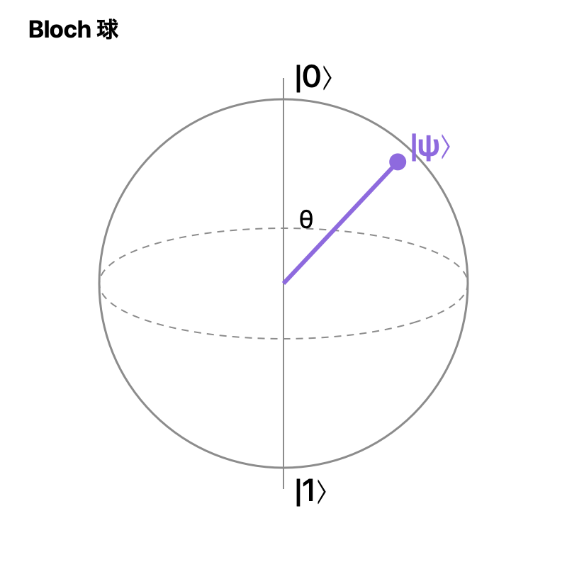

# 量子ビット

$|0\rangle$ と $|1\rangle$ の重ね合わせ。

$$
|\psi\rangle = \alpha|0\rangle + \beta|1\rangle, \quad |\alpha|^2 + |\beta|^2 = 1
$$

## Bloch 球

全体の位相を除くと、状態は球面上の 1 点で表せる。

$$
|\psi\rangle = \cos\frac{\theta}{2}|0\rangle + e^{i\varphi}\sin\frac{\theta}{2}|1\rangle
$$

## 測定

$|0\rangle$ が出る確率は $|\alpha|^2$。測定は[[固有値・固有状態|固有値問題]]として書ける。

次: [[量子ゲート]]
